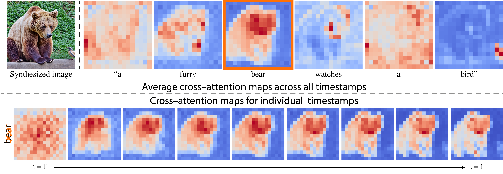

# 🖼️ 그림으로 말해요, 머신러닝! 🤖

<h1 align="center"> Show and Tell: Machine Learning! </h1>

 

<!-- sheilds: https://shields.io/ -->
<!-- hits badge: https://hits.seeyoufarm.com/ -->

> Welcome to the "Show and Tell: Machine Learning!" repository!
Our goal is to deepen our understanding of machine learning by leveraging visualization, showcasing examples of data analysis, model interpretation, and effective communication of insights.
Join us in advancing machine learning visualization through open collaboration and shared learning!

## 🌟 프로젝트 목표 (Project Vision)
_"시각화를 통해 한층 더 깊어지는 머신 러닝에 대한 지식"_

우리의 모델은 무엇을 근거로, 왜 이런 판단을 내렸을까요?

우리는 데이터와 모델에 대해 얼마나 잘 이해하고 있나요?

우리가 이해한 내용을 누군가에게 쉽고 명확하게 설명할 수 있나요?

지식을 표현하고, 설명할 수 있을 때, 우리는 비로소 무언가를 이해했다고 말할 수 있습니다.

우리의 이해를 표현할 수 있는 매력적인 방법 중 하나로 시각화를 주목해보고자 합니다.

----

t-SNE 과정 시각화 [How to Use t-SNE Effectively](https://distill.pub/2016/misread-tsne/)

----

강화 학습 모델의 Attention 시각화 [Understanding RL Vision](https://distill.pub/2020/understanding-rl-vision/)

----

기상 예측 모델 예측 결과 시각화 [Prithvi WxC]()

----

이미지 생성 모델의 Cross-attention 시각화 [Prompt-to-Prompt Image Editing with Cross-Attention Control](https://prompt-to-prompt.github.io/)

----

이처럼 지식을 이미지로 표현하고자하는 열망은 분야를 가리지 않고 보편적입니다. 

우리는 이번 스터디를 통해 시각화 영역에 첫발을 내디디고자 합니다.

분야와 영역을 가리지 않고, 머신 러닝의 시각화에 대한 관심이 있는 분들을 찾습니다.

- 머신 러닝에서 활용하는 다양한 시각화 방법론에 대해서 공부합니다.
- 시각화를 위한 Python 패키지를 공부합니다.
- 연구자들이 어떤 시각화 방법을 활용했는지 함께 공부하고 공유합니다.
- 각자 관심 있는 데이터/모델을 시각화합니다. 

## 🌱 참여 안내 (How to Engage)

**팀원을 찾습니다!**
  - Python 기초를 익히신 분
  - Python 시각화 패키지를 하나 이상 사용해본 경험이 있으신 분
  - Github을 사용할 줄 아시는 분
  - 시각화하고 싶은 데이터, 모델 혹은 다른 개념이 있으신 분!
  - 3개월 동안 성실하게 참여하고, 다른 분들의 발표를 경청할 수 있으신 분

**팀원으로 참여하시려면 러너 모집 기간에 신청해주세요.**  
- 링크 (준비중)

**누구나 모임을 청강 하실 수 있습니다.**  
- 특별한 신청 없이 정기 모임 시간에 맞추어 디스코드 채널로 입장

## 🧑 팀 소개 (Team)

| 역할          | 이름 |          주요 관심 분야                    |
|--------------|-----|----------------------------------------|
| **Project Manager** | 송주환 | T2I Diffusion 모델 Attention Map 시각화 |
| **Member** | - | - |
| **Member** | - | - |

## 🚀 프로젝트 로드맵 (Project Roadmap)

| 파트 | 내용 |
| -- | -------- | 
| 1부 | 재밌고 다양한 시각화 코드 스터디                  | 
| 2부 | 실제 데이터, 모델 시각화를 위한 구체적인 사례 스터디    | 
| 3부 | 나만의 데이터, 모델 시각화                       |

## 🛠️ 우리의 개발 문화 (Our Development Culture)
**우리의 개발 문화**  

- 매주 화요일 저녁에 모여 온라인 스터디를 진행합니다
  - 각자 공부한 시각화 방법론의 특징에 대해 설명합니다
  - 각자 작성한 코드와 결과물을 깃헙 저장소로 공유하고 소개합니다
  - 다음 시간에 공부해서 공유할 주제에 대해 이야기합니다

## 📈 성과 지표 (Achievement Metrics)

| 지표                     | 목표치 | 현재 달성률 |
|-------------------------|--------|-------------|
| 시각화 결과물              | N개   |              |
| 인터렉티브 데모 제작         | M개    |              |

## 💻 주차별 활동 (Activity History)

| 날짜 | 내용 | 발표자 | 
| ---------- | -------- | ---- |      
| 2025/03/04 |  OT | 송주환 | 
| 2025/03/11 |  1부 | 미정 | 
| 2025/03/18 |  1부 | 미정 | 
| 2025/03/25 |  쉬어갑니다! (Magical Week) | - | 
| 2025/04/01 |  1부 | 미정 | 
| 2025/04/08 |  2부 | 미정 | 
| 2025/04/15 |  2부 | 미정 | 
| 2025/04/22 |  2부 | 미정 | 
| 2025/04/29 |  쉬어갑니다! (Magical Week) | - | 
| 2025/05/? |   3부   | - | 
| 2025/05/13 |  3부 | 미정 | 
| 2025/05/20 |  3부 | 미정 | 
| 2025/05/17 |  쉬어갑니다! (PseudoCon) | 미정 | 
| 2025/05/24 |  오프라인 마무리 | 미정 | 

## 💡 학습 자원 (Learning Resources)

- Python 시각화 예제: [Vega-Altair](https://altair-viz.github.io/gallery/index.html),  [matplotlib](https://matplotlib.org/stable/gallery/index.html), [scikit-learn](https://scikit-learn.org/stable/auto_examples/index.html), [plotly](https://plotly.com/python/)
- 기계 학습 시각화 그룹: [Polo Club](https://poloclub.github.io/), [Distill](https://distill.pub/)

## Acknowledgement 🙏

"Show and Tell: Machine Learning!" is developed as part of Pseudo-Lab's Open Research Initiative. Special thanks to our contributors and the open source community for their valuable insights and contributions.

## About Pseudo Lab 👋🏼</h2>

[Pseudo-Lab](https://pseudo-lab.com/) is a non-profit organization focused on advancing machine learning and AI technologies. Our core values of Sharing, Motivation, and Collaborative Joy drive us to create impactful open-source projects. With over 5k+ researchers, we are committed to advancing machine learning and AI technologies.

<h2>Contributors 😃</h2>

  

<h2>License 🗞</h2>
This project is licensed under the [MIT License](https://opensource.org/licenses/MIT).